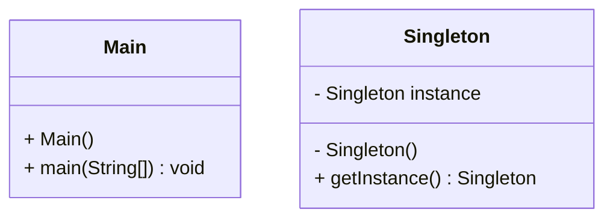

# Desing pattern Singleton 
c'est un exemple d'implementation du design pattern Singleton

```mermaid
classDiagram
direction BT
class Main {
  + Main() 
  + main(String[]) void
}
class Singleton {
  - Singleton() 
  - Singleton instance
  + getInstance() Singleton
}
```